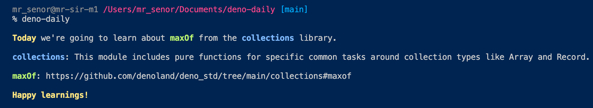

# Daily Deno Standard library topic

> A Deno standard library topic a day keeps the Dinossaur away.



A little tool that helps you discover the
[deno standard library](https://github.com/denoland/deno_std)

## How to use

### By installing as a script

```bash
deno install --name deno-daily --allow-read --allow-write --allow-env  https://raw.githubusercontent.com/kivS/deno-daily/main/main.ts

# then we can run it as a script
deno-daily
```

### By running directly

```bash
deno run --allow-read --allow-write --allow-env  https://raw.githubusercontent.com/kivS/deno-daily/main/main.ts
```
